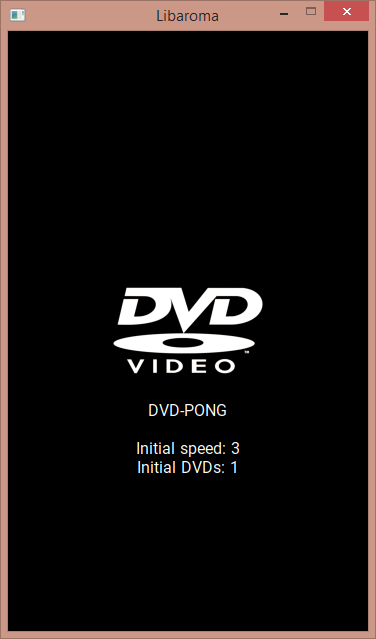

# dvd-pong

## Introduction
This is another dumb game I've written in few days using Libaroma (my favourite C library) and is quite straightforward to build and play.  
It's basically a bouncing DVD player logo, similar to the classic screensaver, but you must move the bottom racket to prevent it to fall otherwise you will loose.  
Every time you make dvd bounce with the racket at bottom, it becomes faster. After 6 score, a new DVD appears (slow as startup).  
It's recursive, so every new DVD that appears can spawn another one at score 6 (up to 8 DVDs).  
Up/down arrows and volume up/down keys increase/lower the speed for the first DVD.

## How to use
- Install/build libaroma
- Compile the main.c file linking to libaroma
- Run passing the path to res.zip file as first or third argument

## Tested on
Windows (thanks Libaroma SDL support), Linux (android recovery, armhf static binary).

## Why?
Some day, I was talking with a friend while developing something (the classic build system for libaroma) and he sent me a dvd screensaver gif, which gave me the idea to recreate it using libaroma.  
After that, I've said him that it could be easy to make the screensaver user interactive, and after few minutes of thinking how, I put hands at work and here I am :P

## Screenshots

## License
The font file contained inside res.zip (Roboto-Regular.ttf) is covered by the Open Font License.  
As with almost all my projects, I use the Apache 2.0 license for my code (see [LICENSE.md](LICENSE.md) file).
